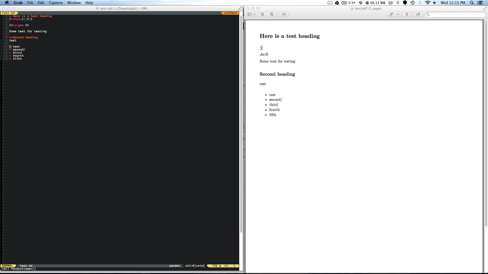

pandoc-viewer
=============
This project is a quick hack that helps my workflow when working with Pandoc Markdown documents.

My goal was to be able to write Pandoc style markdown specifically to be able to write LaTeX inline
or block code within a markdown document. My preferred workflow would be vim with an auto updating
pdf viewer alongside whenever file changes are written (perhaps something more fancy in the future).

It looks like this:



The code is setup as a Go project that watches for files changes. On file changes it executes this
chain of command
```
pandoc <filename>.md -o <filename>.pdf; open -a Preview; open -a MacVim
```
This compiles the pandoc document, brings Preview into focus so it pulls changes from disk, then opens
MacVim to change focus back.

Contributions are welcome if you are interested in extending this to more than just my own workflow

###ASIDE 
I realized after writing the current code and understanding my needs in this tool (ya, the customer never knows what they want, including if you are the customer yourself) that there is a much easier way to accomplish what I wanted. In short, this should have been a Vim function calling shell commands in my .vimrc with a keybinding to go with it. 

Below is the current function I use calling to this GoCode, when I have some time I may go back and write the Vim function I should have started with to do it the "right" way. Nevertheless, I am leaving this code up here because:

1. It was a good exploration of different Go Libraries, no reason I can't use this as a reference or reuse code for a future tool that a vim function wouldn't be ideally suited for.
2. Shameless self plug, it shows off some of my recent code on a purely for fun hack (read as not strictly needing to be well tested with a good suite of unit tests)

```
" Configure vim to use my pandoc-viewer code
function! PandocViewer()
	silent execute "w"
	silent !clear
	silent execute "!pandoc-viewer c " . split(expand('%:t'), ".md")[0]
endfunction
nnoremap <Leader>cc :call PandocViewer()<cr>
```

###END ASIDE
